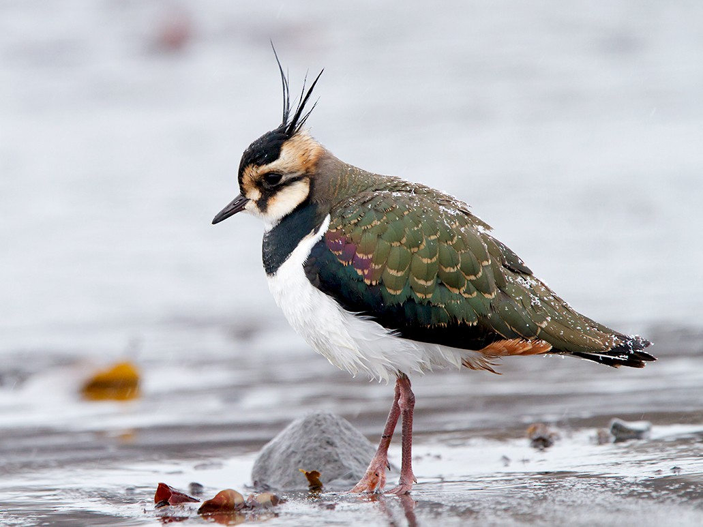

<body style="background-color:lightgreen;">

---
title: "Julie Kastanis: Mixed Models Assignment"
output: html_document
---

"We tracked eight adult northern lapwings, Vanellus vanellus, (six females and two males) from a Dutch breeding colony by light-level geolocation year-round, three of them for multiple years. We show that birds breeding virtually next to each other may choose widely separated wintering grounds, stretching from nearby the colony west towards the UK and Ireland, and southwest through France into Iberia and Morocco. However, individual lapwings appeared relatively faithful to a chosen wintering area, and timing of outward and homeward migration can be highly consistent between years. Movements of migratory individuals were usually direct and fast, with some birds covering distances of approximately 2000 km within 2 to 4 days of travel. The two males wintered closest and returned earliest to the breeding colony. The female lapwings returned well before the onset of breeding, spending a pre-laying period of 19 to 54 days in the wider breeding area. Despite the potential for high migration speeds, the duration that birds were absent from the breeding area increased with distance to wintering areas, a pattern which was mainly driven by an earlier outward migration of birds heading for more distant wintering grounds. Moreover, females that overwintered closer to colony bred earlier. A large variation in migration strategies found even within a single breeding colony has likely supported the species’ responsiveness to recent climate change as evidenced by a shortened migration distance and an advanced timing of reproduction in Dutch lapwings since the middle of the 20th century (Eichhorn et al., 2017)."




```{r setup, include=FALSE}
knitr::opts_chunk$set(echo = TRUE)
```

```{r library}
library(tidyverse)
library(lme4)
library(lmerTest)
library(emmeans)
library(performance)
library(ggplot2)
library(see)
library(patchwork)
library(pbkrtest)
library(ggtext)
library(asbio)
library(ggfortify)
```


```{r read data_lapwing}
lapwing1 <- read.csv("lapwing1.csv")
lapwing1$Bird <- as.factor(lapwing1$Bird)
lapwing1$Year <- as.factor(lapwing1$Year)
```

#Averaged repeated measures of distance from colony on eight individual Northern Lapwings. Data is presented from repeated measurements taken in the years 2007, 2008, and 2009. 

```{r ggplot_lapwing1}
p1<- ggplot(lapwing1, aes(x=Year, y=Distance_Colony_AVG, group=Bird, color=Bird, shape=Bird)) + 
  geom_point(size=4, position = position_dodge2(width=.33, preserve = "total")) +
  scale_y_continuous() +
  #geom_line() +
  geom_smooth(method = "lm", se = FALSE) +
  labs(title="Northern Lapwing AVG Distance from Colony", x= "Year", y = "Average Distance from Colony (km)")

p1
```

```{r distance_means}
years_means <- lapwing1 %>%
  group_by(Year) %>%
  summarise(mean_Distance_Colony_AVG=mean(Distance_Colony_AVG),
            se_Distance_Colony_AVG=sd(Distance_Colony_AVG)/sqrt(n()))
years_means
```
#The mean distance from the colony shows a decrease over the three years of measurement. Only two indivuduals out of eight were measured in 2009; Individuals GEBL and ORWI.

```{r mixed_lapwing1}
mixed_lapwing1 <- lmer(Distance_Colony_AVG ~ Year + (1|Bird), data = lapwing1)
```

```{r anova_lapwing1}
anova(mixed_lapwing1)
```

```{r summary_lapwing1}
summary(mixed_lapwing1)
```
#High P-values for Year, Bird, and Year:Bird; Y= Distance_Colony_AVG

```{r performance_check, fig.height=8,fig.width=6}
performance::check_model(mixed_lapwing1)
```

```{r model-adjusted_means}
#calculate model-adjusted means (e.g. estimated marginal means)
mixed_lapwing1_emm <- emmeans(mixed_lapwing1, "Year")
```

```{r results of adjusted_means}
mixed_lapwing1_emm
```


```{r raw}
years_means
```

```{r pairs}
pairs(emmeans(mixed_lapwing1, "Year"))
```

Part Two

"Carotenoid pigments are found in the retinas of many vertebrate species, where they serve a range of functions. In birds, carotenoid-containing retinal oil droplets act as optical filters, modifying the light reaching the underlying visual pigment and thereby enhancing color vision. Dietary carotenoid manipulation is known to affect the allocation of carotenoids to the retina, although the effects this has on vision are less well understood. Using dietary manipulations, in which juvenile Japanese quail (Coturnix japonica) received either a high- or a low-carotenoid diet, we tested the effects of carotenoid availability on the ability to perform a color discrimination task. Birds on both diet treatments were able to make a relatively coarse discrimination between colors that appeared to humans as yellow-orange and orange; however, only high-carotenoid diet birds were able to make a finer-scale discrimination involving intermediate colors, showing that dietary carotenoid availability can directly affect the ability of birds to make chromatic discriminations. This finding has implications for our understanding of trade-offs in carotenoid allocation between vision and other key functions such as sexual ornamentation and health maintenance, and suggests that variation in dietary carotenoid availability may affect the ability of animals to make ecologically pertinent color discriminations, such as between sexual signals or cryptic food items (Lim et al., 2016)."


```{r read data_JQ}
Carotenoid_Diet <- read_csv("Carotenoid_Diet.csv")
Carotenoid_Diet$ID <- as.factor(Carotenoid_Diet$ID)
Carotenoid_Diet$Level <- as.factor(Carotenoid_Diet$Level)
Carotenoid_Diet$Diet <- as.factor(Carotenoid_Diet$Diet)
```

```{r quail scatter}
ggplot(Carotenoid_Diet, aes(Diet, Latency, colour = Level)) + 
  geom_point(size=5) +
   annotate("text", x = 1.25, y = 45, label = "12 Juvenile JQ, 2 Diet Types: high | low = 6 JQ/diet") +
  annotate("text", x = 1.5, y = 40, label = "3 Levels of Chromatic Discrimination")
```

```{r ggplot for diets, fig.height=5}
ggplot(Carotenoid_Diet, aes(Diet, Latency, colour = as.factor(ID), shape=as.factor(Level))) + 
  geom_jitter(width =0.25, size=6) +
  annotate("text", x = 2, y = 75, label = "2 diets with 6 Quail/diet") +
  annotate("text", x = 2, y = 65, label = "3 Food Discrimination Levels") +
  annotate("text", x = 2, y = 55, label = "36 total measurements", size=6, color="blue")

```

#"First, lets do it the wrong way and show how pseudoreplication can result in incorrect analyses. Of primary interest is the detection of differences in the fixed factor of diet. By treating each measure in each liver preparation in each rat as independent observations, we get a model with inflated degrees of freedom (Aho, 2014)."

```{r anova_quail_wrongway}
anova(lm(Latency ~ Diet, data = Carotenoid_Diet))
```
#The analysis tells us that df error = 34
#There are 12 juvenile Japanese Quail in this experiement
#"Pseudoreplication has artificially inflated sample sizes, and increased the probability of type I error. Using a mixed-model approach, we can obtain variance components estimates for the model (Aho, 2014)."

```{r lmer_Quail}
quail.1 <- lmer(Latency ~ Diet * Level + (1|ID), data = Carotenoid_Diet)
quail.1
```
###Make comparisons for whatever is missing example H1 may be missing then that means the model is comparing all others to H1
## also confirm Confirm the random effects # of observations info make sense. Helps you check and confirm the language you are using is accurate 
```{r summary_Quail}
summary(quail.1)
```

```{r anova_quail}
anova(quail.1)
```
####Look at P-value here 
